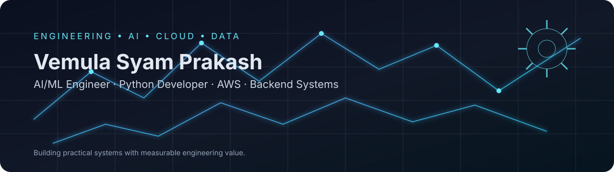
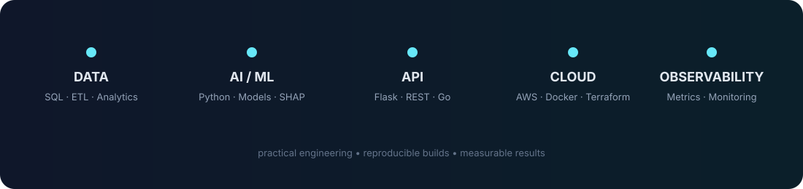

# Hey, I'm Vemula Syam Prakash

### AI/ML Engineer | Python Developer | AWS Cloud | Data & Backend Systems

Building practical AI applications, data-driven systems, APIs, and cloud solutions that turn complex technical problems into usable products.

---

## About Me

- MCA graduate with a **Statistics background**, combining quantitative analysis with software and application development.
- Build practical **AI/ML applications** using Python, Scikit-learn, feature engineering, model evaluation, and explainability.
- Work across **AWS cloud, REST APIs, databases, ETL workflows, backend systems, deployment, and monitoring**.
- Currently strengthening my engineering portfolio through projects such as **NanoLink, CodeForge**, and AI-powered applications, while remaining open to AI/ML, Python, cloud, data, backend, and open-source opportunities.

---

## What I Build

### AI & Machine Learning
Predictive applications, classification models, feature engineering, model evaluation, explainability, and practical ML workflows.

### Cloud & Data Systems
AWS architectures, ETL pipelines, SQL workflows, databases, APIs, deployment, monitoring, caching, and analytics systems.

### Python & Backend Applications
Flask REST APIs, full-stack applications, dashboards, reporting systems, distributed backend services, and automation-oriented tooling.

### Agentic AI & Developer Automation
Multi-agent software engineering workflows, repository-aware coding agents, automated testing and repair loops, security controls, human approval gates, Git/GitHub automation, and production-oriented orchestration.

---

## GitHub Statistics

---

## Featured Projects

| Project | What it does | Core Stack | Links |
| --- | --- | --- | --- |
| **CodeForge** | Security-conscious autonomous software factory that turns software requests into a controlled plan → research → architecture → code → test → debug → review → security → approval → PR workflow | Python, LangGraph, FastAPI, Ollama, PostgreSQL, ChromaDB, Docker, GitHub Actions | [Repo](https://github.com/shyamprakash534/Codeforge) · [Live](https://codeforge-3l85.onrender.com) |
| **NanoLink** | Distributed URL shortener with caching, rate limiting, analytics architecture, observability, and cloud infrastructure | Go, Gin, PostgreSQL, Redis, ClickHouse, Docker, Terraform | [Repo](https://github.com/shyamprakash534/nanolink1) · [Live](https://nanolink1.onrender.com) |
| **AI Drug Recommendation & Dosage Prediction** | Full-stack ML application covering 5 medical conditions and 15 drugs; 94% model accuracy with explainability and safety rules | Python, Scikit-learn, Flask, SHAP, AWS | [Repo](https://github.com/shyamprakash534/drug-recommendation) · [Live](https://drug-recommendation-5uxr.onrender.com) |

---

## Engineering Highlights

### CodeForge — Autonomous Software Factory

- Designed a multi-agent engineering workflow with **Planner, Researcher, Architect, Coder, Tester, Debugger, Reviewer, and Security** stages.
- Implemented **LangGraph-based orchestration** with conditional routing, bounded retries, and stateful workflow execution.
- Added an autonomous **test → debug → recode → retest** repair loop rather than stopping at the first test failure.
- Added repository-aware reasoning using **AST/source ingestion, hybrid retrieval, and optional ChromaDB**.
- Implemented security controls including workspace confinement, shell/Git allow-lists, secret detection, dangerous-call checks, prompt-injection findings, timeouts, Docker sandboxing, and human approval gates.
- Added **PostgreSQL and SQLite** database support plus Git/GitHub tooling for branch → commit → push → pull-request automation.
- Exposed the system through **FastAPI, Streamlit, CLI, and a deployed Render web interface**.
- Added observability/evaluation infrastructure, Docker Compose services, Prometheus/Grafana configuration, and GitHub Actions CI.

### NanoLink

- Built a Go/Gin distributed URL-shortening service with REST APIs.
- Implemented Redis caching and rate limiting for redirect traffic.
- Used PostgreSQL for persistent URL metadata and Redis Streams for asynchronous analytics ingestion.
- Designed ClickHouse-based analytics architecture for click and event workloads.
- Containerized the system with Docker and defined AWS infrastructure using Terraform.
- Added Prometheus-compatible metrics, Grafana monitoring, automated tests, and GitHub Actions workflows.

### AI Drug Recommendation & Dosage Prediction

- Engineered recommendations across **5 medical conditions and 15 drugs**.
- Achieved **94% model accuracy** using Random Forest and Gradient Boosting.
- Processed **941 patient records** with feature engineering and cross-validated evaluation using accuracy and F1-score.
- Added **SHAP explainability** and **5 clinical safety override rules**.
- Developed a Flask REST API with a responsive 5-screen interface, Matplotlib charts, PDF reporting, and session-based history.
- Designed AWS architecture using Elastic Beanstalk, S3, RDS, IAM, SageMaker, and CloudWatch.
- Authored a Springer-format technical paper documenting the methodology, evaluation, and results.

---

## Technical Stack

**Programming**  
Python • Go • SQL • JavaScript

**AI / ML / Agents**  
Scikit-learn • Random Forest • Gradient Boosting • Decision Trees • Predictive Modeling • SHAP • LangGraph • Ollama • ChromaDB

**Data**  
Pandas • NumPy • MySQL • PostgreSQL • AWS Glue/Athena • ETL Architecture • Tableau • Matplotlib

**Cloud**  
AWS S3 • EC2 • Lambda • RDS • IAM • CloudWatch • Elastic Beanstalk • SageMaker • Boto3

**Backend / Web**  
FastAPI • Flask • REST APIs • Gin • Streamlit • HTML/CSS • Jinja2

**DevOps / Tooling**  
Docker • Terraform • GitHub Actions • Prometheus • Grafana • Git • GitHub • Render

---

## Certifications

- **AWS Cloud Practitioner (CLF-C02)** — AWS · 2026
- **Google AI Professional Certificate** — Google / Coursera · August 2026
- **Oracle Certified Foundations Associate – Agentic AI** — Oracle · 2026

---

## Current Focus

- [ ] Building practical AI/ML applications with Python
- [ ] Improving model evaluation, feature engineering, and explainability
- [ ] Developing scalable REST APIs and backend services
- [ ] Strengthening AWS cloud architecture and deployment skills
- [ ] Building data engineering and ETL workflows
- [ ] Improving Docker, infrastructure, CI/CD, and observability skills
- [ ] Building practical Agentic AI systems and autonomous developer tools
- [ ] Building and documenting projects publicly

---

## Engineering Principles

- **Evidence over hype** — communicate measurable technical results where evidence exists.
- **Practical AI** — use machine learning where it solves a real problem rather than adding AI for its own sake.
- **Cloud-ready engineering** — consider deployment, monitoring, maintainability, and operational behavior.
- **Controlled autonomy** — automate engineering work while keeping security controls, bounded retries, and human approval where appropriate.
- **Clear documentation** — make projects understandable, reproducible, and useful to other developers.

---

## Collaboration

I'm open to connecting on:

- AI/ML engineering opportunities
- Python and backend development
- AWS / cloud engineering
- Data engineering and analytics
- AI-powered products
- Agentic AI and developer automation
- Hackathons and technical projects
- Open-source collaboration

If you're building something technically interesting, feel free to connect or explore my repositories.

---

## Explore My Work

- **[CodeForge](https://github.com/shyamprakash534/Codeforge)** — Autonomous Software Factory
- **[NanoLink](https://github.com/shyamprakash534/nanolink1)** — Distributed URL Shortener
- **[AI Drug Recommendation](https://github.com/shyamprakash534/drug-recommendation)** — AI/ML Application
- **[LinkedIn](https://www.linkedin.com/in/shyam-prakash-vemula-721029263/)** — Professional Profile

---

### I enjoy building practical AI, data, cloud, and agentic systems that turn complex technical workflows into useful products.

