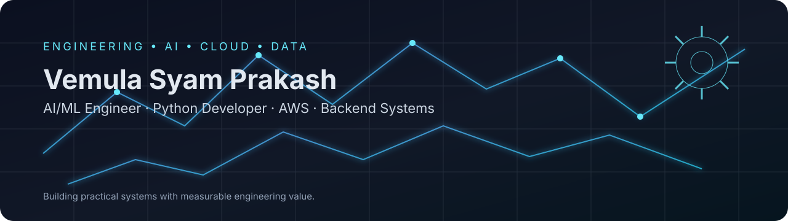

# Hey, I'm Vemula Syam Prakash

### Python Developer | AI/ML & GenAI | Backend | Cloud & Data Engineering

Building practical AI applications, backend systems, data pipelines, and cloud solutions with a focus on reproducibility, security, and useful products.

---

## What I Build

- **AI/GenAI:** RAG systems, agentic workflows, LLM applications, evaluation and explainability
- **Python/Backend:** FastAPI, Flask, REST APIs, developer tooling and automation
- **Cloud/Data:** AWS data workflows, ETL, analytics and infrastructure-as-code
- **Systems:** Distributed services, caching, databases, observability and containerized deployment

## Featured Projects

| Project | What it demonstrates | Core Stack | Links |
| --- | --- | --- | --- |
| **CodeForge** | Security-conscious multi-agent software engineering workflow with testing, repair, review and approval | Python, LangGraph, FastAPI, Docker, GitHub Actions | [Repo](https://github.com/shyamprakash534/Codeforge) · [Live](https://codeforge-3l85.onrender.com) |
| **NanoLink** | Distributed URL shortener with caching, rate limiting, asynchronous analytics and observability | Go, Gin, PostgreSQL, Redis, ClickHouse, Docker, Terraform | [Repo](https://github.com/shyamprakash534/nanolink1) · [Live](https://nanolink1.onrender.com) |
| **Grounded RAG** | Local-first document RAG with semantic retrieval and source-backed answers | Python, FastAPI, ChromaDB, Ollama | [Repo](https://github.com/shyamprakash534/grounded-rag) · [Live](https://grounded-rag-oww5.onrender.com) |
| **AWS E-Commerce Data Pipeline** | AWS-style raw → curated → analytics workflow with an interactive output layer | AWS S3, Glue, Athena, PySpark, Terraform, SQL, Python | [Repo](https://github.com/shyamprakash534/aws-ecommerce-data-pipeline) · [Live](https://aws-ecommerce-data-pipeline.onrender.com) |
| **JobMatch AI** | Resume parsing and source-first job matching with weighted relevance scoring | Python, FastAPI, httpx, pypdf, python-docx, JavaScript | [Repo](https://github.com/shyamprakash534/ai-job-application-tracker) · [Live](https://ai-job-application-tracker-o9vp.onrender.com) |
| **AI Drug Recommendation** | End-to-end educational ML application with prediction and explainability | Python, Scikit-learn, Flask, SHAP | [Repo](https://github.com/shyamprakash534/drug-recommendation) · [Live](https://drug-recommendation-5uxr.onrender.com) |

## About Me

- MCA graduate with a Statistics background, combining quantitative analysis with software development.
- Build practical AI/ML applications using Python, Scikit-learn, feature engineering, model evaluation and explainability.
- Work across REST APIs, databases, ETL workflows, backend systems, deployment, monitoring, caching and analytics.
- Interested in Python/backend development, AI/ML and GenAI engineering, AWS/cloud engineering and data engineering.

## Technical Stack

**Programming:** Python • Go • SQL • JavaScript  
**AI/ML:** Scikit-learn • Random Forest • Gradient Boosting • SHAP • LangGraph • Ollama • ChromaDB • RAG  
**Data:** Pandas • NumPy • MySQL • PostgreSQL • AWS Glue/Athena • ETL • Tableau • Matplotlib • Plotly  
**Cloud:** AWS S3 • EC2 • Lambda • RDS • IAM • CloudWatch • Elastic Beanstalk • SageMaker • Boto3  
**Backend/Web:** FastAPI • Flask • REST APIs • Gin • Streamlit • HTML/CSS • Jinja2  
**DevOps:** Docker • Terraform • GitHub Actions • Git • GitHub • Render

## Engineering Principles

- Evidence over hype.
- Practical AI over unnecessary AI.
- Deployment, monitoring and maintainability matter.
- Controlled autonomy with security controls and human approval where appropriate.
- Clear documentation and reproducible projects.

## Certifications

- AWS Cloud Practitioner (CLF-C02) — AWS · 2026
- Google AI Professional Certificate — Google / Coursera · August 2026
- Oracle Certified Foundations Associate – Agentic AI — Oracle · 2026

---

I build practical AI, backend, cloud and data systems that turn complex technical workflows into useful products.

